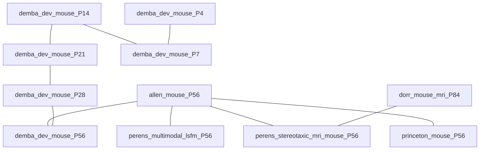

# Translation Graph

This diagram shows the available translation paths between coordinate spaces.

```mermaid
graph TD
    allen_mouse_P56 --- demba_dev_mouse_P56
    allen_mouse_P56 --- perens_multimodal_lsfm_P56
    allen_mouse_P56 --- perens_stereotaxic_mri_mouse_P56
    allen_mouse_P56 --- princeton_mouse_P56
    demba_dev_mouse_P14 --- demba_dev_mouse_P21
    demba_dev_mouse_P14 --- demba_dev_mouse_P7
    demba_dev_mouse_P21 --- demba_dev_mouse_P28
    demba_dev_mouse_P28 --- demba_dev_mouse_P56
    demba_dev_mouse_P4 --- demba_dev_mouse_P7
    dorr_mouse_mri_P84 --- perens_stereotaxic_mri_mouse_P56
```